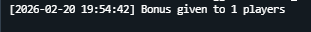
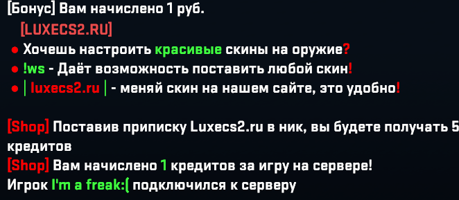

# GameTimeBonus

Плагин для Counter-Strike 2 (CS2) на базе CounterStrikeSharp, который начисляет бонусные деньги игрокам за проведённое время на сервере.

## Возможности

- Автоматическое начисление бонуса игрокам за время игры на сервере
- Интеграция с MySQL базой данных для хранения баланса игроков
- Поддержка мультиязычности (русский, английский, украинский)
- Настраиваемый интервал и сумма бонуса
- Логирование всех операций
- Исключение ботов и HLTV из системы бонусов

## Требования

- Counter-Strike 2
- CounterStrikeSharp
- .NET 8.0
- MySQL сервер

## Установка

1. Скопируйте папку `GameTimeBonus` в директорию:
   ```
   csgo/addons/counterstrikesharp/plugins/
   ```

2. Скопируйте папку `lang` с файлами локализации в:
   ```
   csgo/addons/counterstrikesharp/plugins/GameTimeBonus/lang/
   ```

3. Настройте подключение к базе данных в конфигурационном файле.

4. Перезапустите сервер или загрузите плагин через Metamod.

## Конфигурация

При первом запуске плагин автоматически создаст файл конфигурации `GameTimeBonus.json` в директории:
```
csgo/addons/counterstrikesharp/configs/plugins/GameTimeBonus/
```

### Параметры конфигурации

```json
{
    "Version": 1,
    "Database": {
        "Host": "localhost",
        "Port": 3306,
        "Username": "root",
        "Password": "",
        "Name": "new"
    },
    "Settings": {
        "BonusIntervalSeconds": 600,
        "BonusAmount": 1,
        "EnableLogging": true
    }
}
```

| Параметр | Описание | Значение по умолчанию |
|----------|----------|----------------------|
| `BonusIntervalSeconds` | Интервал начисления бонуса в секундах | 600 |
| `BonusAmount` | Сумма бонуса | 1 |
| `EnableLogging` | Включить логирование | true |

## База данных

Плагин использует таблицу `lk` со следующей структурой:

```sql
CREATE TABLE IF NOT EXISTS lk (
    id INT AUTO_INCREMENT PRIMARY KEY,
    auth VARCHAR(64) NOT NULL,
    cash DECIMAL(10, 2) DEFAULT 0,
    UNIQUE KEY auth (auth)
);
```

- `auth` - SteamID игрока в формате STEAM_1:0:XXXXX
- `cash` - баланс игрока

## Локализация

Плагин поддерживает следующие языки:
- Русский (ru)
- Английский (en)
- Украинский (uk)

### Файлы локализации

- `lang/ru.json` - Русский
- `lang/en.json` - Английский
- `lang/uk.json` - Украинский

### Настройка сообщения

Измените значение `BonusMessage` в соответствующем файле для настройки сообщения о бонусе:

```json
{
    "BonusMessage": "[Бонус] Вам начислено {amount} руб."
}
```

Где `{amount}` будет заменено на сумму бонуса.

## Логирование

Логи сохраняются в файл:
```
csgo/addons/counterstrikesharp/logs/GameTimeBonus.log
```

Логи содержат информацию о:
- Подключении к базе данных
- Подключении и отключении игроков
- Начислении бонусов
- Ошибках

## Компиляция

Для компиляции плагина выполните:

```batch
cd GameTimeBonus
compile.bat
```

Или вручную:

```bash
dotnet publish -c Release -o ./compile/addons/counterstrikesharp/plugins/GameTimeBonus
```

## Версии

- **Версия плагина**: 1.0.0
- **Версия .NET**: 8.0
- **Зависимости**: 
  - CounterStrikeSharp.API
  - MySqlConnector 2.3.1

## Автор

- **Автор**: PattHs
- **Версия CounterStrikeSharp API**: 1.0.362

## Лицензия

Свободное использование.

## Скриншоты

### Консоль сервера


### Интерфейс плагина

